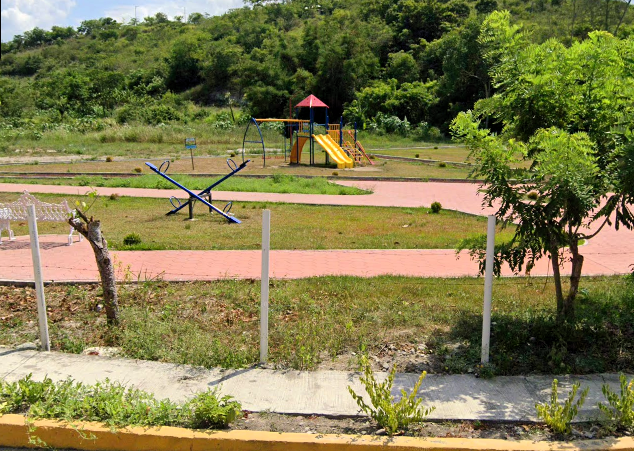

# 🗺️Programa Aula Escuela y Comunidad (PAEC) en el Parque Xanath🌳

## Resumen
El Programa Aula Escuela y Comunidad (PAEC) es una iniciativa llevada a cabo en el Parque Xanath por alumnos del Colegio de Estudios Científicos y Tecnológicos del Estado de Veracruz, 02 Papantla CECyTEV. Este programa tiene como objetivo promover la educación ambiental y el cuidado del entorno natural entre los visitantes del parque, especialmente los niños.

  

Parque Xanath

## Objetivos
- Educar a los visitantes sobre la importancia de conservar y proteger el medio ambiente.
- Desarrollar habilidades prácticas y de liderazgo en los alumnos del CECyTEV a través de su participación en el programa.
- Establecer una conexión entre la escuela, el parque y la comunidad local.

## Actividades
Como parte del PAEC, los alumnos del CECyTEV realizan diversas actividades en el Parque Xanath:

1. **Sembrado y cuidado de plantas**
2. **Actividades lúdicas y recreativas**
3. **Limpieza y mantenimiento del parque**

## Beneficios
El PAEC ha generado diversos beneficios tanto para los alumnos del CECyTEV como para la comunidad del Parque Xanath:

- Desarrollo de habilidades de liderazgo, trabajo en equipo y responsabilidad social en los estudiantes.
- Aprendizaje práctico y divertido sobre cuidado del medio ambiente para los visitantes.
- Mejor estado y mayor educación ambiental en el Parque Xanath.

## Cómo contribuir
Si deseas contribuir al proyecto PAEC, puedes:

1. **Descargar o Forkear el repositorio**: Puedes clonar el repositorio en tu máquina local o hacer un fork del mismo en tu cuenta de GitHub.
2. **Hacer Pull Request**: Si encuentras alguna mejora o corrección que quieras realizar, puedes enviar un pull request con tus cambios.

## Demo
Puedes ver una demostración del proyecto PAEC en el Parque Xanath visitando este [enlace](https://www.ejemplo.com/paec-demo).

  

Proyecto PAEC

## Copyright
Este proyecto ha sido desarrollado por Angel Salazar alumno de 4C del Colegio de Estudios Científicos y Tecnológicos del Estado de Veracruz, 02 Papantla CECyTEV. © 2024 CECyTEV. Todos los derechos reservados.